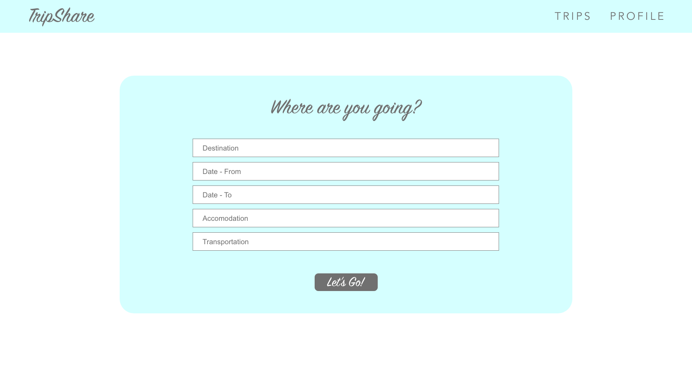

# trip-share
Unit 3 Project by Atarius Armstrong

TripShare is a fullstack MERN web application meant to log future group travel plans.

[Heroku Deployment](https://peaceful-bayou-99236.herokuapp.com/)
[Trello](https://trello.com/invite/b/lXhvvYkM/a06b9bf9144a8d30a44fb1ac58e26f57/tripshare)

Wireframe
---
created with Adobe XD

Dependencies
---
* Mongoose
* Express
* React
* Node.js
* Axios
* Styled-Components
* React-Animations

Technologies Used
---
* Language: HTML5, CSS3, Javascript
* Adobe Photoshop
* Adobe XD
* Royalty free images: Unsplash
* Royalty free icons: [Lucy Gonzalez of Dribble](https://dribbble.com/shots/2488469-Basic-Ui-Set)
* [Redirecting in React](https://medium.com/@anneeb/redirecting-in-react-4de5e517354a) courtesy of Anne Barrett

