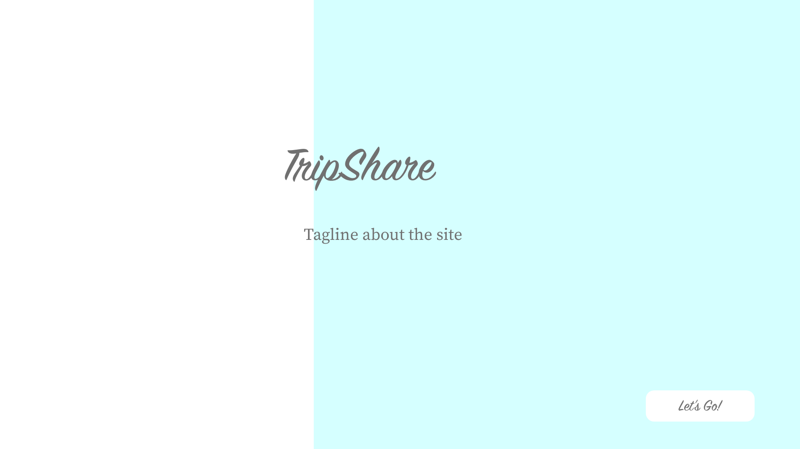
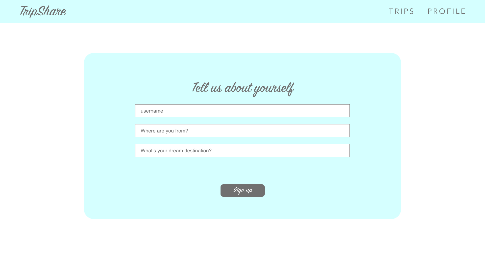
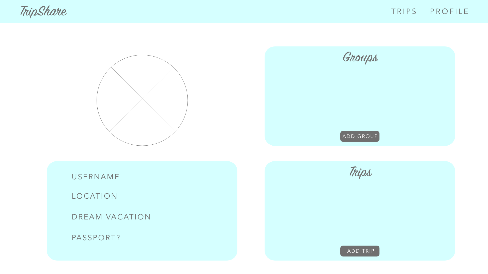
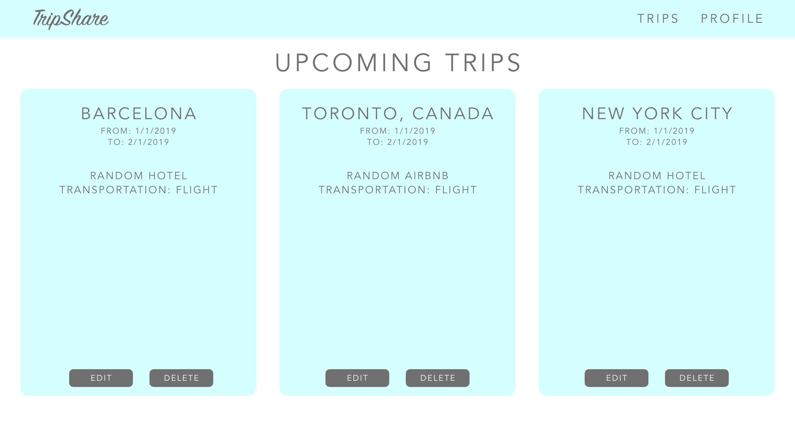
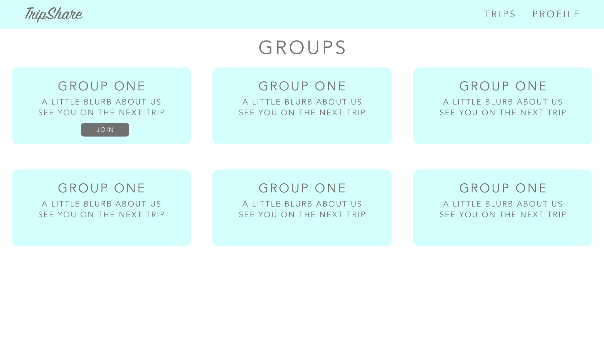

# trip-share
###Unit 3 Project by Atarius Armstrong

TripShare is a fullstack MERN web application meant to log future group travel plans.

Wireframe
---

Dependencies
---
* Mongoose
* Express
* React
* Node.js
* Axios
* Styled-Components
* React-Animations

Technologies Used
---
* Language: HTML5, CSS3, Javascript
* Royalty free images: Unsplash
* Royalty free icons: [Lucy Gonzalez of Dribble](https://dribbble.com/shots/2488469-Basic-Ui-Set)

Photo by Phil Coffman on Unsplash